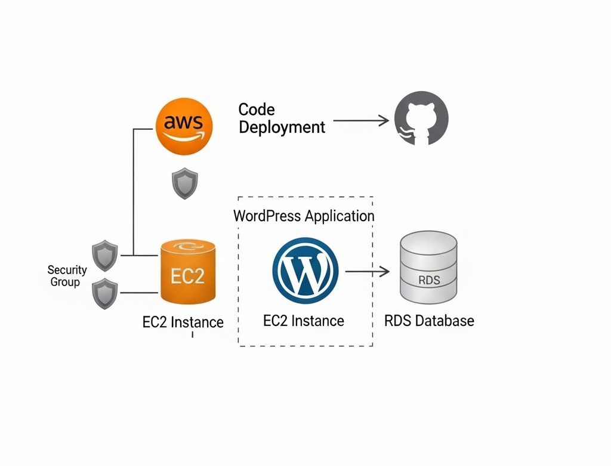
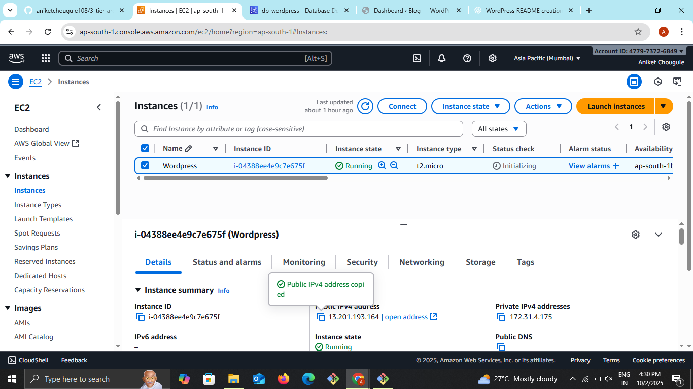
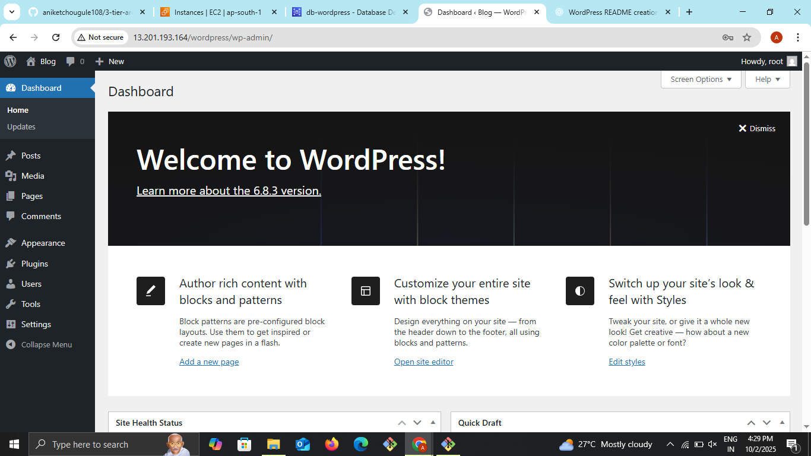

# Building Wordpress Website With EC2 & RDS
## Introduction
This project demonstrates how to deploy a WordPress website using Amazon EC2 for the web server and Amazon RDS for the MySQL database. The setup follows a scalable and production-ready architecture where the database is decoupled from the web server, ensuring better performance, security, and maintainability.  

By decoupling the database from the web server, this architecture achieves:

* ⚡ Better Performance  
* 🔐 Improved Security  
* 📈 Scalability (add more EC2 servers if traffic grows)  
* 🛠  Easier Maintenance

---
## Architecture Overview


### Flow of Architecture:

**EC2 Instance** → Hosts Nginx, PHP, and WordPress files  
**RDS Instance (MySQL)** → Stores the WordPress database separately  
**Security Groups** → Control access 
* Allow **HTTP/HTTPS** traffic to EC2  
* Allow **MySQL (3306)** traffic only from the EC2 security 

---
## 🚀 Step-by-Step Deployment
### 1. Launch EC2 Instance
* **OS :** Amazon Linux 2 (Free Tier eligible)
* install Nginx, PHP, MySQL client
* Download and configure WordPress in /usr/share/nginx/html
* **Security Group :** Allow ports 22 (SSH), 80 (HTTP), 443 (HTTPS)  
* Connect to EC2 via **SSH**:



---
### 2. Launch RDS Instance
* **Engine :** MySQL
* **Free Tier :** `db.t2.micro`
* Create database `wordpressdb`
* Create a DB user `wp_user` with a strong password
* **Configure Security Group:** Allow inbound 3306 (MySQL) only from EC2’s Security Group


---
###  3. Setup and Test
* Restart Nginx.
* Visit EC2 public IP → WordPress installation page should appear.
* Set site name, admin user, password.

---
### 4. Configure WordPress with RDS
* Open `wp-config.php`:
* Update with your RDS details :
```define('DB_NAME', 'wordpressdb');
define('DB_USER', 'wp_user');
define('DB_PASSWORD', 'YourPassword');
define('DB_HOST', 'yt-wordpress.c32yqweg2qug.ap-southeast-1.rds.amazonaws.com');
```
.png)
---
### 5. Complete WordPress Setup
1. Restart Nginx :  
2. Open browser → http://   `EC2-Public-ip`  
3. WordPress installation wizard will appear  
4. Set: 
     * Site Title
     * Admin Username & Password
     * Admin Email



---
## 🛠 Technologies Used

* **AWS EC2** → Compute for hosting WordPress
* **AWS RDS (MySQL)** → Managed database service
* **Nginx** → Web server
* **PHP** → Backend runtime for WordPress
* **WordPress CMS** → Website platform

---
## 🔐 Security Best Practices

* Use **EC2 Security Groups** to allow traffic only on necessary ports (80, 443, 22).
* Restrict **MySQL (3306)** access to only the EC2 Security Group (not 0.0.0.0/0).
* Disable root login for MySQL, always use a separate DB user.
* Use **IAM roles** instead of hardcoding AWS credentials (if integrating with S3 or CloudFront).
* Enable SSL **(HTTPS)** with Let’s Encrypt on EC2.
---
## 💰 Cost Optimization Tips
* Use **EC2 Free Tier** `(t2.micro / t3.micro)` for small websites.
* Use **RDS Free Tier** with `db.t2.micro.`
* Stop EC2/RDS instances when not in use (for learning projects).
* Use **Reserved Instances** if hosting long-term production workloads.

---

## ✅ Conclusion
This deployment demonstrates how to :  

✔ Deploy WordPress on AWS EC2  
✔ Use Amazon RDS for secure and scalable database hosting  
✔ Configure Nginx, PHP, and WordPress  
✔ Apply security and scalability best practices
